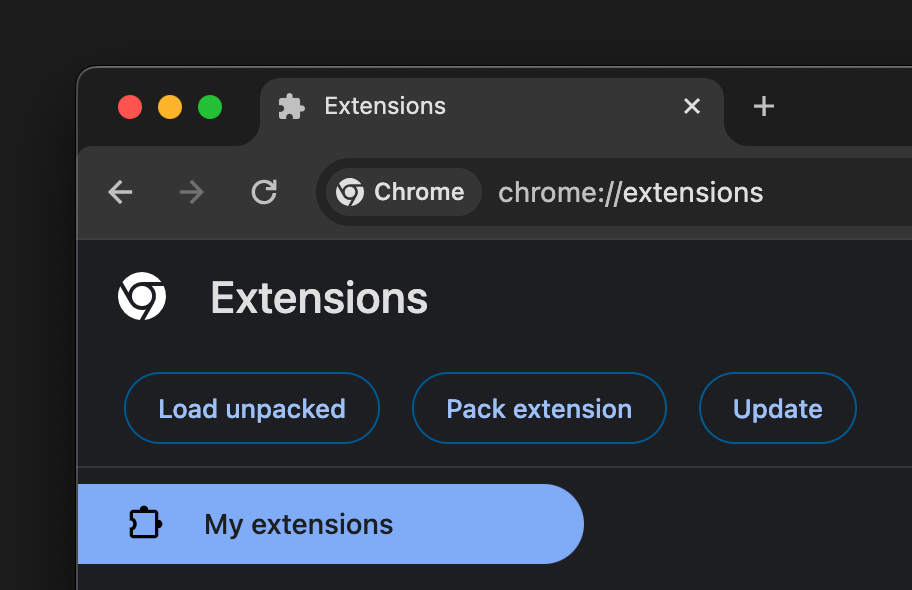
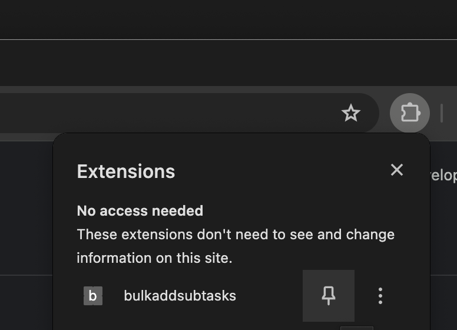

# Yeeha

Yeeha is a browser extension that extends Jira without paid plugins or external services.
It runs against your existing Jira session and keeps product data in local browser storage.

## Installation

### Chrome

1. Download the latest [release](https://github.com/vanprime/yeeha/releases).
2. Open `chrome://extensions/` and enable Developer mode.
3. Click Load unpacked and select the release folder.
4. Pin the extension and open the side panel.

## Data Privacy

No API tokens or credentials are required. The extension uses your existing Jira session
cookies with `credentials: "include"`, and there is no analytics or telemetry pipeline.

### Network Calls

The extension communicates with:

| Destination | Methods | What for |
| --- | --- | --- |
| Your source Jira instance | `GET` | Read issues, comments, links, projects, workflows, boards, and SCM metadata |
| Your target Jira instance | `GET`, `POST`, `PUT` | Create or update issues, upload attachments, transition issues, and validate target configuration |
| `api.github.com` | `GET` | Check for extension releases |

### Local Storage

| Mechanism | What it stores |
| --- | --- |
| IndexedDB `yeeha-migrate-issues` | Migration history, checkpoints, lineage, and sync results |
| IndexedDB `yeeha-data-analysis` | Legacy analysis datasets |
| `chrome.storage.local` | Extension state, project metadata, and wizard state |
| `localStorage` | UI preferences only |
